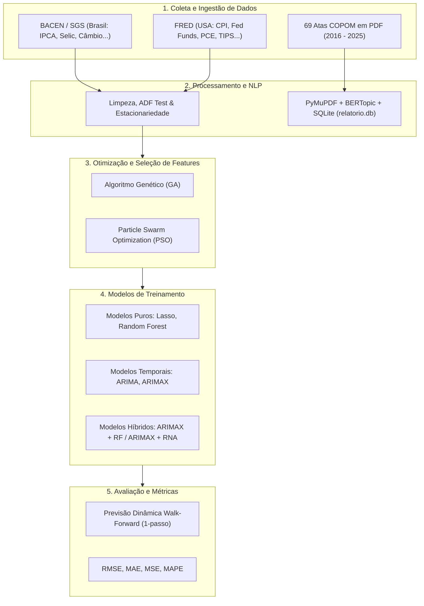

# Relatório Consolidado: Mineração de Dados e Otimização Computacional para Previsão da Inflação

> **Natureza do Projeto:** Projeto de Pesquisa / Iniciação Científica (IC) em Ciência de Dados, Econometria Computacional e Inteligência Artificial.  
> **Tema Central:** Previsão de Índices de Inflação (IPCA no Brasil e CPI nos EUA) através da integração de Modelos Híbridos de Séries Temporais, Aprendizado de Máquina, Otimização Bioinspirada (Meta-heurísticas) e Processamento de Linguagem Natural (NLP).

---

## 1. Visão Geral e Proposta do Projeto

### 1.1. Contexto e Problema de Pesquisa
A inflação é uma das variáveis macroeconômicas mais críticas e voláteis para governos, bancos centrais, empresas e investidores. No entanto, sua modelagem enfrenta grandes desafios:
1. **Comportamento Misto (Linear e Não Linear):** Séries temporais de inflação possuem tendências e autocorrelações lineares, mas também sofrem impactos não lineares abruptos causados por choques de oferta/demanda, políticas governamentais e dinâmicas setoriais.
2. **Alta Dimensionalidade Macroeconômica:** Existem dezenas de variáveis macroeconômicas correlacionadas (câmbio, juros, commodities, emprego, energia), gerando ruído e *overfitting* se utilizadas sem critério.
3. **Informações Qualitativas e Expectativas de Mercado:** Decisões e comunicados de autoridades monetárias (como as atas do COPOM do Banco Central do Brasil) contêm sinais prospectivos cruciais que não aparecem de imediato em números contábeis.

### 1.2. A Proposta da Solução
O projeto propõe uma **abordagem computacional ponta a ponta** estruturada em quatro pilares fundamentais:
- **Engenharia de Dados Macroeconômicos:** Coleta automatizada de séries históricas do Banco Central do Brasil (SGS/BCB) e dos Estados Unidos (FRED/Federal Reserve).
- **Mineração de Texto e NLP em Documentos Oficiais:** Extração e modelagem de tópicos em 69 Atas do COPOM (2016 a 2025) via `BERTopic` e `SentenceTransformers`.
- **Seleção Inteligente de Atributos (Feature Selection):** Uso de Algoritmos Genéticos (**GA**) e Otimização por Enxame de Partículas (**PSO**) para encontrar os subconjuntos de variáveis exógenas mais preditivos.
- **Modelos Preditivos Híbridos (Linear + Não Linear):** Combinação de modelos econométricos clássicos (**ARIMA** e **ARIMAX**) com algoritmos de Machine Learning (**Random Forest** e **Redes Neurais Artificiais**) especializados em modelar os resíduos não lineares.



---

## 2. Arquitetura Detalhada por Módulos

### 2.1. Módulo de Dados Macroeconômicos (`Dados/`)
- **Brasil (`df_macro.csv` e `dados_macro.ipynb`):**
  - Coleta automática via API do Sistema Gerenciador de Séries Temporais do Banco Central (`python-bcb` / SGS).
  - Período: Março de 2012 a 2026 (frequência mensal contínua, ~29 variáveis exógenas).
  - *Critério do Marco Inicial (2012):* Justificado pela transição metodológica da mensuração do desemprego pelo IBGE (adoção da PNAD Contínua em nível nacional em substituição à PME das 6 capitais), nova ponderação do IPCA com base na POF 2008-2009 e padronização das séries setoriais do SGS/BACEN em painel balanceado, mitigando quebras estruturais espúrias.
  - *Variável Alvo ($y$):* `IPCA` (Código SGS 4447).
  - *Variáveis Exógenas ($X$):* Desagregações do IPCA (Transportes, Alimentação/Bebidas, Saúde, Vestuário, Educação, Despesas Pessoais), Índices de Preços (IGP-M, IGP-DI, INPC, IPC-BR), Variáveis Financeiras (Taxa Selic, Câmbio USDBRL, Reservas Internacionais), Atividade Econômica (PIB Mensal, Desemprego, Estoque de Empregos Formais CAGED por setor) e Consumo de Energia e Derivados de Petróleo (Gasolina, Óleo Combustível, Energia Elétrica Comercial/Residencial).
- **Estados Unidos (`dados_USA/`):**
  - Coleta de dados macroeconômicos do Federal Reserve Bank of St. Louis (FRED).
  - *Variável Alvo ($y$):* `Inflacao_CPI` (Consumer Price Index).
  - *Variáveis Exógenas ($X$):* `Inflacao_CPI_Core`, `Taxa_Juros_Fed`, `PCE`, `PCE_Core`, `Desemprego_menos_27_semanas`, `Permissoes_Construcao`, `Capacidade_Instalada`, `PIB_Real`, `Deflator_PIB`, `Indice_Dolar`, `TIPS_5_anos_nominal`, `TIPS_5_anos_infl_ajustado`, `Producao_Industrial`, `Emprego_Total_Nao_Agricola`.

---

### 2.2. Módulo de Mineração de Texto e NLP (`Extracao_topicos/`)
Este módulo analisa o conteúdo discursivo e as decisões de política monetária presentes nas atas de reuniões do COPOM.

- **Corpus de Documentos:** 69 arquivos PDF oficiais cobrindo o período de Julho/2016 (Reunião 200) até Janeiro/2025 (Reunião 268).
- **Pipeline de Extração:**
  1. Extração de texto bruto via `fitz` (PyMuPDF) com fallback para `pdfplumber`.
  2. Divisão algorítmica por expressões regulares nas 4 seções oficiais do regulamento do COPOM:
     - **Seção A:** Atualização da conjuntura econômica internacional e doméstica.
     - **Seção B:** Cenários prospectivos e balanço de riscos para a inflação.
     - **Seção C:** Discussão sobre a condução da política monetária.
     - **Seção D:** Decisão final do Comitê (fixação da meta da Taxa Selic).
  3. Pré-processamento e remoção de *stopwords* em português com `nltk`.
  4. Persistência estruturada em banco de dados relacional **SQLite** (`relatorio.db`), com tabelas individualizadas para metadados e tópicos por seção.
  5. Vetorização densa com **Sentence Transformers** (`all-MiniLM-L6-v2`) e modelagem semântica de tópicos com **BERTopic**, viabilizando a extração de sinais temáticos de incerteza e expectativas de inflação.

---

### 2.3. Módulo de Seleção de Atributos (`Feature selection/`)
O espaço amostral de variáveis macroeconômicas pode conter multicolinearidade e ruídos espúrios. Para selecionar os subconjuntos ótimos de *features*, implementaram-se duas meta-heurísticas de otimização estocástica:

```
Vetor de Decisão Binário (Cromossomo / Posição da Partícula):
X = [ 1,  0,  1,  1,  0,  ... ,  1 ] -> (1 = Variável Incluída, 0 = Variável Excluída)
```

1. **Algoritmos Genéticos (GA):**
   - **População e Gerações:** Conjunto de cromossomos binários evoluindo ao longo de gerações.
   - **Operadores Genéticos:** Seleção por torneio/roleta, recombinação (*crossover*) uniforme e mutação bit-flip.
   - **Função de Fitness:** Avaliação do erro de previsão (RMSE/MAPE) do modelo ARIMAX ou ARIMAX Híbrido treinado estritamente com as variáveis selecionadas pelo cromossomo.
2. **Otimização por Enxame de Partículas (PSO):**
   - **Dinâmica de Partículas:** Partículas que se movem no espaço de busca orientadas por sua melhor posição individual (*pbest*) e pela melhor posição global do enxame (*gbest*).
   - **PSO Discreto/Binário:** Aplicação de função de transferência sigmoide para mapear velocidades contínuas em probabilidades de ativação da variável:
     $$S(v_{id}) = \frac{1}{1 + e^{-v_{id}}}$$
   - **Modelos Avaliados no PSO:** Lasso, Random Forest, ARIMAX e ARIMAX Híbrido.

#### Variáveis Selecionadas pelas Meta-heurísticas (Exemplos Consolidados):
| Contexto | Algoritmo | Modelo Base | Variáveis Macroeconômicas Selecionadas |
| :--- | :--- | :--- | :--- |
| **Brasil** | **PSO** | ARIMAX | `IPCA_Educação`, `USDBRL`, `INPC`, `IPC_BR`, `Consumo_Energia_Residencial` |
| **Brasil** | **PSO** | ARIMAX+RF | `IPCA_Transportes`, `IGP_DI`, `Produção_Derivados_Petróleo`, `Consumo_Gasolina`, `Estoque_Empregos_Formais_Total` |
| **EUA** | **GA** | ARIMAX | `Inflacao_CPI_Core`, `Desemprego_menos_27_semanas`, `Taxa_Juros_Fed`, `Permissoes_Construcao`, `Capacidade_Instalada`, `PCE`, `TIPS_5_anos_nominal` |
| **EUA** | **GA** | ARIMAX+RF | `Inflacao_CPI_Core`, `Salario_Medio_Real_Hora`, `PCE`, `Deflator_PIB`, `TIPS_5_anos_infl_ajustado` |
| **EUA** | **PSO** | ARIMAX+RF | `Inflacao_CPI_Core`, `PCE_Core`, `PCE`, `PIB_Real`, `PIB` |

---

### 2.4. Módulo de Modelagem Preditiva e Hibridização (`Modelos de treinamento/`)

#### 2.4.1. Fundamentação Teórica da Modelagem Híbrida
Séries temporais econômicas podem ser decompostas em uma componente linear autorregressiva com impacto exógeno linear ($L_t$) e uma componente residual não linear ($N_t$):
$$y_t = L_t + N_t$$

1. **Passo 1 (Modelo Linear Econométrico):**
   Ajusta-se um modelo **ARIMA** ou **ARIMAX** para prever o componente linear $\hat{L}_t$:
   $$\hat{L}_t = \mu + \sum_{i=1}^p \phi_i y_{t-i} + \sum_{j=1}^q \theta_j \epsilon_{t-j} + \sum_{k=1}^m \beta_k X_{k, t}$$
2. **Passo 2 (Cálculo dos Resíduos):**
   Calculam-se os resíduos lineares $\epsilon_t$, que contêm padrões não lineares não capturados pelo ARIMAX:
   $$\epsilon_t = y_t - \hat{L}_t$$
3. **Passo 3 (Modelo de Resíduos Não Lineares via ML):**
   Treina-se um regressor de Machine Learning (como **Random Forest** ou **Rede Neural Artificial MLP**) para estimar os resíduos $\hat{N}_t = \hat{\epsilon}_t$ em função das variáveis exógenas $X_t$:
   $$\hat{N}_t = f_{ML}(X_t)$$
4. **Passo 4 (Previsão Híbrida Final):**
   $$\hat{y}_t = \hat{L}_t + \hat{N}_t$$

#### 2.4.2. Estratégia de Validação e Estacionariedade
- **Teste de Estacionariedade:** Função `make_stationary` com teste Augmented Dickey-Fuller (ADF). Aplica diferenciação sucessiva $\Delta y_t$ caso $p\text{-value} \ge 0.05$.
- **Previsão Dinâmica Walk-Forward (1-passo à frente):** Divisão temporal 80% treino / 20% teste sem *data leakage*. O modelo é atualizado a cada período temporal com as informações reais até $t-1$ para prever $t$.

---

## 3. Análise Comparativa de Resultados e Métricas

Os experimentos foram avaliados rigorosamente com quatro métricas de erro:
- **RMSE** (*Root Mean Squared Error*)
- **MAE** (*Mean Absolute Error*)
- **MSE** (*Mean Squared Error*)
- **MAPE** (*Mean Absolute Percentage Error*)

### 3.1. Resultados Consolidados - Brasil (IPCA)

| Modelo | Configuração de Features | MAE | MSE | RMSE | MAPE (%) |
| :--- | :--- | :---: | :---: | :---: | :---: |
| **Random Forest Puro** | Todas as features | 0.5722 | 0.4623 | 0.6799 | 761.92% |
| **ARIMA Clássico** | Apenas série temporal (sem exógenas) | 0.3243 | 0.1520 | 0.3899 | 2.60% |
| **Lasso Regression** | Features selecionadas | 0.2675 | 0.1037 | 0.3220 | 155.72% |
| **ARIMAX** | Otimizado via GA | 0.3005 | 0.1423 | 0.3772 | 2.85% |
| **ARIMAX** | Otimizado via PSO | 0.2620 | 0.1067 | 0.3267 | 2.86% |
| **ARIMAX** | Todas as features | 0.2128 | 0.0669 | 0.2587 | 2.31% |
| **ARIMA Híbrido (ARIMA + RF)** | Resíduos modelados por RF | 0.1317 | 0.0360 | 0.1898 | 0.82% |
| **ARIMAX Híbrido (ARIMAX + RF)** | Otimizado via PSO | 0.1319 | 0.0292 | 0.1708 | 1.26% |
| **ARIMAX Híbrido (ARIMAX + RF)** | Otimizado via GA | 0.0974 | 0.0160 | 0.1267 | **0.64%** |
| **ARIMAX Híbrido (ARIMAX + RF)** | Todas as features | **0.0850** | **0.0110** | **0.1046** | 1.03% |

> [!TIP]
> **Ganho de Desempenho no Brasil:**
> - A transição do **ARIMA tradicional** (RMSE 0.3899) para o **ARIMA Híbrido** (RMSE 0.1898) gerou uma **redução de erro superior a 51%**.
> - O **ARIMAX Híbrido** atingiu o melhor resultado absoluto do projeto com RMSE de **0.1046** (redução de **73%** em relação ao ARIMA básico e de **84%** em relação ao Random Forest puro).

---

### 3.2. Resultados Consolidados - Estados Unidos (CPI)

| Modelo | Configuração de Features | MAE | MSE | RMSE | MAPE (%) |
| :--- | :--- | :---: | :---: | :---: | :---: |
| **ARIMAX** | Otimizado via PSO | 0.8495 | 1.4035 | 1.1847 | 1.42% |
| **ARIMAX** | Otimizado via GA | 0.8429 | 1.2895 | 1.1356 | 1.78% |
| **ARIMAX** | Todas as features | 0.8266 | 1.3694 | 1.1702 | 1.76% |
| **ARIMA Clássico** | Apenas série temporal | 0.8399 | 1.2347 | 1.1112 | 1.34% |
| **ARIMA Híbrido (ARIMA + RF)** | Resíduos modelados por RF | 0.4031 | 0.3808 | 0.6171 | 0.79% |
| **ARIMAX Híbrido (ARIMAX + RF)** | Todas as features | 0.3479 | 0.2476 | 0.4976 | 0.65% |
| **ARIMAX Híbrido (ARIMAX + RF)** | Otimizado via GA | 0.3187 | 0.1956 | 0.4423 | **0.48%** |
| **ARIMAX Híbrido (ARIMAX + RF)** | Otimizado via PSO | **0.3025** | **0.1762** | **0.4197** | 0.60% |

> [!TIP]
> **Ganho de Desempenho nos Estados Unidos:**
> - Nos EUA, a seleção de atributos via **PSO** combinada com a arquitetura híbrida **ARIMAX + Random Forest** alcançou o menor erro geral (RMSE **0.4197** e MAE **0.3025**), superando o modelo com todas as features (RMSE 0.4976), demonstrando que o PSO eliminou ruído redundante do mercado norte-americano.

---

## 4. Principais Conclusões Científicas e Técnicas

1. **Superioridade Incontestável da Modelagem Híbrida:**  
   Modelos lineares puros (ARIMA/ARIMAX) falham em momentos de choque econômico, enquanto modelos de ML puros (Random Forest/Lasso) têm dificuldade em manter consistência estocástica em séries temporais puras. A abordagem de usar o ARIMAX para capturar a dinâmica linear estrutural e o Random Forest / Redes Neurais para modelar os resíduos reduziu o erro em mais de 50% em ambos os países.

2. **Eficácia das Meta-heurísticas de Otimização (GA e PSO):**  
   Os algoritmos GA e PSO conseguiram reduzir a quantidade de variáveis de ~30 para 5 a 7 variáveis-chave sem perda estatística de poder preditivo, gerando modelos mais enxutos, computacionalmente eficientes e interpretáveis.

3. **Validação Cruzada Internacional (Brasil e EUA):**  
   A metodologia foi validada com sucesso tanto em uma economia emergente com histórico de volatilidade inflacionária (Brasil) quanto na maior economia do mundo (EUA), provando sua robustez metodológica e replicabilidade.

4. **Integração Multimodal com NLP:**  
   A estruturação e clusterização temática das Atas do COPOM via BERTopic estabelece uma base sólida para enriquecer os modelos preditivos com índices de sentimento monetário e incerteza econômica textual.

---

## 5. Mapeamento da Estrutura de Arquivos do Repositório

```
Mineração de dados/
│
├── Dados/                                       # Bases de dados macroeconômicos e scripts de ingestão
│   ├── df_macro.csv                             # Base consolidada Brasil (IPCA + 29 variáveis exógenas)
│   ├── dados_macro.ipynb                        # Script de download via API SGS / Banco Central
│   └── dados_USA/
│       ├── dados_macroeconomicos_usa.csv        # Base macroeconômica EUA (FRED)
│       └── Untitled0.ipynb                      # Notebook de apoio / ingestão FRED
│
├── Extracao_topicos/                            # Módulo de NLP e Mineração de Texto
│   ├── extracao_pdf.ipynb                       # Pipeline BERTopic, SentenceTransformers, SQLite
│   └── Relatorio-COPOM/                         # 69 Atas do COPOM em PDF (2016 a 2025)
│       ├── 2016_07_COPOM200.PDF
│       └── ... (até 2025_01_COPOM268.PDF)
│
├── Feature selection/                           # Módulo de Otimização e Seleção de Features
│   ├── Brasil/
│   │   ├── Algoritmo genético_/                 # Notebooks GA (ARIMAX, Híbrido) e features salvas
│   │   └── PSO/                                 # Notebooks PSO (Lasso, RF, ARIMAX, Híbrido) e features salvas
│   └── USA/
│       ├── Algoritmo genetico/                  # Notebooks GA para os EUA e features salvas
│       └── PSO/                                 # Notebooks PSO para os EUA e features salvas
│
└── Modelos de treinamento/                      # Modelos preditivos finais e avaliação
    ├── ARIMA + ARIMA hibrido_/                  # Notebook ARIMA e ARIMA Híbrido (Brasil)
    ├── ARIMAX + ARIMAX hibrido_/                # Notebooks ARIMAX, ARIMAX+RF e ARIMAX+RNA (Brasil)
    ├── Lasso.ipynb                              # Modelo Lasso (Brasil)
    ├── Random Forest.ipynb                      # Modelo Random Forest puro (Brasil)
    ├── Resultados.xlsx                          # Consolidação completa de métricas (Brasil)
    └── USA/                                     # Modelos equivalentes aplicados aos EUA
        ├── ARIMA_hibrido(USA).ipynb
        ├── ARIMAX(USA).ipynb
        ├── ARIMAX_hibrido(USA).ipynb
        ├── Cópia de Lasso.ipynb
        └── Cópia de Resultados.xlsx             # Consolidação completa de métricas (EUA)
```
